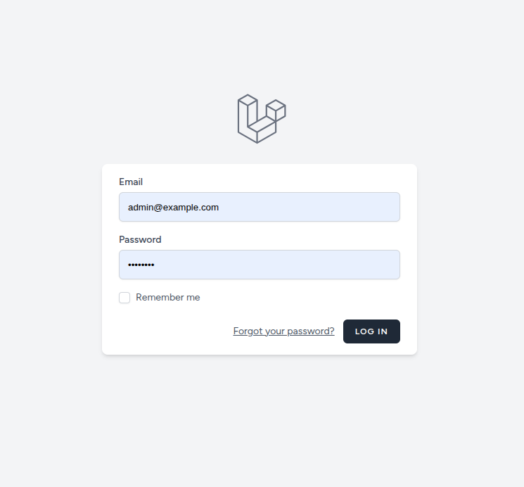
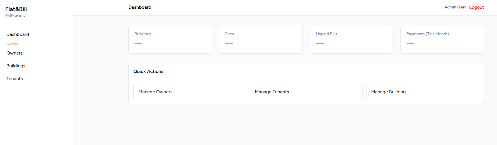
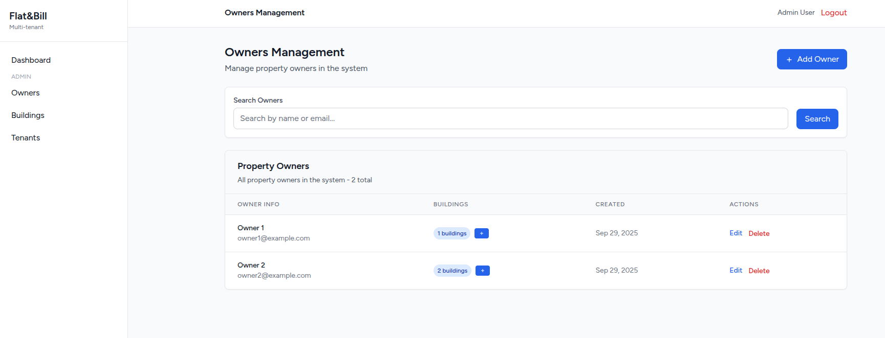
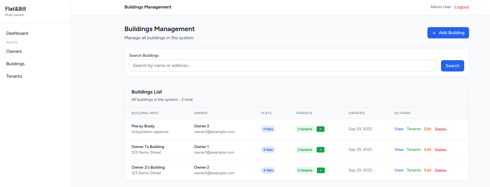
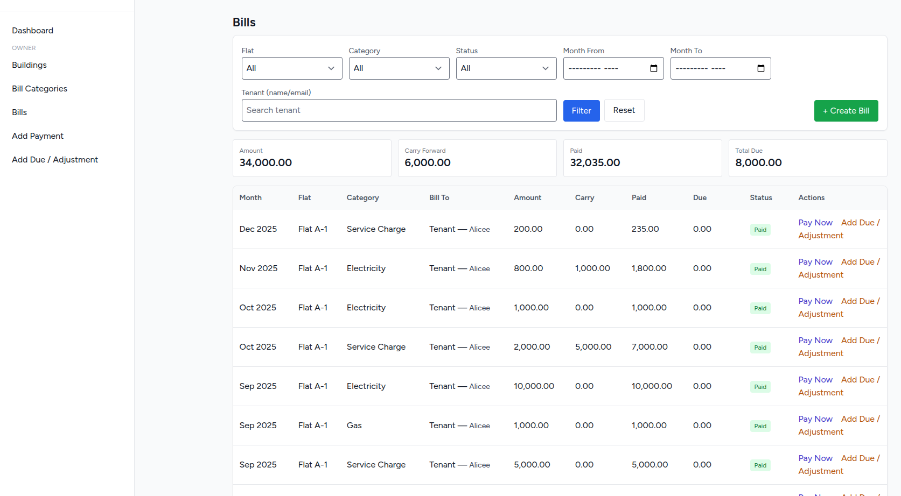
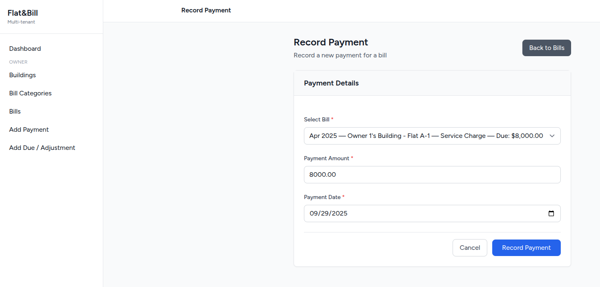
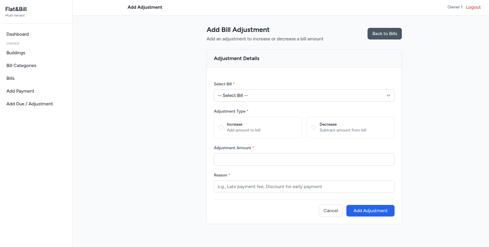

# Multi-Tenant Flat & Bill Management System

A Laravel 12 application for **building/flat management** with **multi-tenant billing**.  
Supports **Super Admin → House Owners → Tenants** roles, flat assignments, bill generation, payments, and due/adjustment tracking.

---

## Features

- **Super Admin**
  - Manage House Owners
  - Manage Buildings
  - Manage Tenants
  - Assign Tenants to Buildings

- **House Owner**
  - Manage Buildings & Flats
  - Assign Tenants Flats
  - Manage Bill Categories (Electricity, Gas, Water, etc.)
  - Generate Flat-wise Bills (per Category, per Month)
  - Track Dues & Carry Forward
  - Add **Manual Adjustments** (late fees, discounts, waivers)
  - Record **Payments**
  - Email notifications for Bill Created / Bill Paid

- **Tenant**
  - (Future scope) login and view bills/payments

---

## Setup Instructions

### 1. Clone & Install
```bash
git clone https://github.com/rifatcse09/multi-tenant-flat-bill
cd multi-tenant-flat-bill
composer install
npm install && npm run dev
```

### 2. Environment
```bash
cp .env.example .env
php artisan key:generate
```
Update `.env` for DB, mail, and subdomain if needed.

### 3. Database
```bash
php artisan migrate --seed
```
Seeds include:
- Super Admin user
- Sample House Owner & Tenant

### 4. Run locally
```bash
php artisan serve
```
- Open: http://localhost:8000

### 5. Subdomain (if enabled)
This project supports **subdomain-based tenant isolation** (optional).  
- Set `SESSION_DOMAIN=.local.test` in `.env`
- Add `/etc/hosts` entries like:
  ```
  127.0.0.1 admin.local.test
  127.0.0.1 owner1.local.test
  ```
- Access via http://admin.local.test:8000

> For the assessment, **column-based tenant scoping** (`owner_id` on models) is used by default. Subdomain routing is optional.

---

## Multi-Tenant Implementation

- **Column-based tenant isolation**  
  Every resource (`buildings`, `flats`, `bill_categories`, `bills`) has an `owner_id`.  
  Global scopes (`OwnerScope`) ensure owners only see their own data.

- **Super Admin** is scoped separately and can manage all house owners/buildings/tenants.

- **Pivot tables** (`building_tenant`, `flat_tenant`) manage assignments:
  - Admin approves tenants for buildings.
  - Owners assign tenants to specific flats with start/end dates (no overlaps).

- **Carry Forward vs Adjustments**
  - Carry Forward: auto-applied when generating new bills if previous bills unpaid.
  - Adjustments: manual interventions (late fees, discounts, corrections).

---

## Optimization & Query Notes

- **Eager Loading** (`with()`) used to avoid N+1 queries (e.g., bills with flat, category, tenant).
- **Database Indexes**:
  - Unique `(owner_id, flat_id, bill_category_id, month)` on `bills` to prevent duplicate bills.
  - Indexes on `flat_id, tenant_id` in pivot tables for fast joins.
- **Accessors** on `Bill` model (`gross`, `paid`, `due`) centralize financial calculations.
- **Soft Deletes**: Used for major entities (Users, Buildings, Flats, Bills) to preserve audit history.
- **Services Layer** (`BillService`, `PaymentService`, `AdjustmentService`) keeps controllers thin and reusable.
- **Validation** via FormRequests ensures tenant assignment doesn’t overlap and prevents overpayments.

---

## Design Decisions

1. **Multi-Tenant Isolation**
   - Chose **column-based** isolation (via `owner_id`) for simplicity and quick local testing.
   - Subdomain routing supported but optional.

2. **Ledger-based Billing**
   - Bills, Payments, and Adjustments are append-only (audit-friendly).
   - Dues are always recalculated, not overwritten.

3. **Extensible**
   - Easy to extend with APIs (e.g., expose bills/payments to tenants).
   - Notifications abstracted, so can swap mail for SMS later.

4. **UI**
   - Blade + TailwindCSS for lightweight, assessment-friendly frontend.

---

## Development Notes

- Built with **Laravel Breeze (Blade)** auth scaffold.
- Queue-ready (for sending bill/payment emails asynchronously).
- Modular service layer for testability.
- Resource controllers with `only([...])` where partial CRUD is required.

---

## Credentials (for testing)

After seeding:
- Super Admin: `admin@example.com / password`
- Owner: `owner1@example.com / password`

---

## Next Steps / Improvements

- Dashobard (Total Building, Flats, Unpaid Bills, Payment This Month)
- Tenant portal (login & view bills)
- Export bills/payments (CSV, PDF)
- Role-based API (for mobile app integration)
- Real-time notifications (Websockets)

## Screenshots

### Login Page


### Super Admin Dashboard


### Owers


### Buildings


### Tenants House Owners


### Buildings House Owners


### Bills House Owners


### Payment House Owners


### Bill Adjustment House Owners
